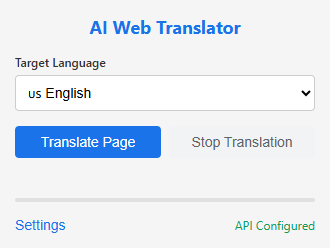
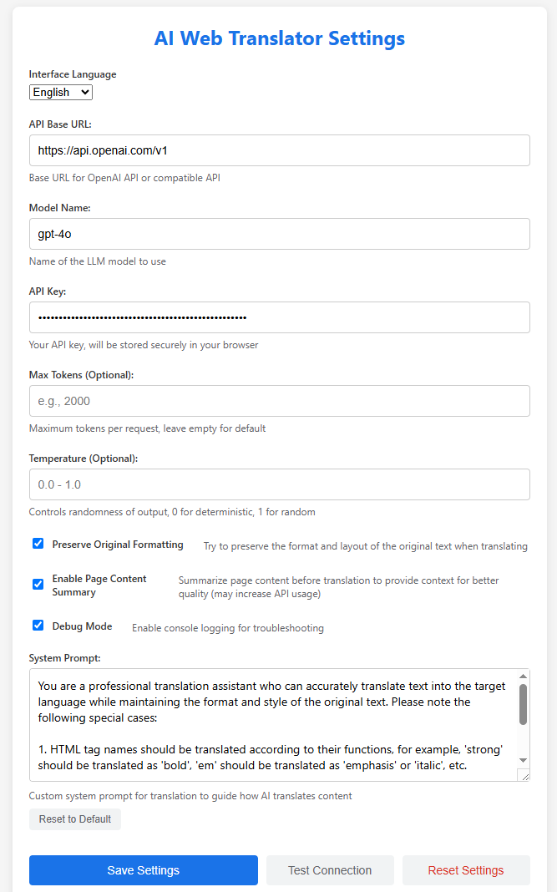
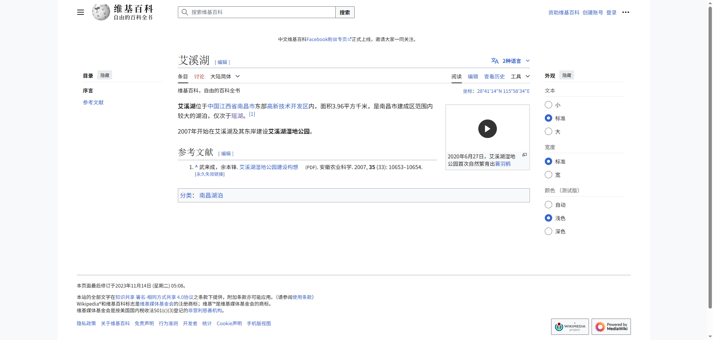
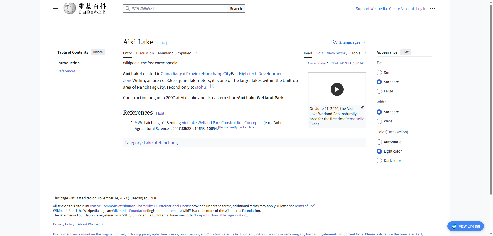

# AI Web Translator Chrome Extension

English | [简体中文](README_CN.md)

## Project Introduction

AI Web Translator is a Chrome browser extension based on Large Language Models (LLM), designed to provide more accurate and natural webpage translation compared to traditional machine translation. It can replace Chrome's built-in translation feature, understanding the overall context of webpages through AI technology to deliver more precise translation results.

## Core Features

### 🤖 High-Quality LLM-Based Translation

- Utilizes Large Language Models for translation, providing more natural and accurate results compared to traditional machine translation
- Supports webpage content summarization to improve translation quality by understanding the entire context
- Preserves the original webpage format and layout, offering a seamless reading experience

### ⚙️ Highly Customizable

- **Custom API Configuration**: Supports OpenAI API and compatible interfaces, with customizable API Base URL
- **Custom Model Selection**: Choose different LLM models (such as deepseek-reasoner, gpt-4o, claude-3-7-sonnet, etc.)
- **Custom Translation Parameters**: Adjust temperature, maximum token count, and other parameters
- **Custom System Prompts**: Customize translation system prompts to precisely control translation style and quality

### 🌐 Multi-Language Support

- Supports translation between multiple languages (Simplified Chinese, English, Japanese, Korean, French, German, Spanish, Russian, etc.)
- Extension interface available in both Chinese and English

### 🔄 Convenient User Experience

- One-click translation of the current webpage
- Quick toggle between original text and translation
- Ability to stop translation at any time
- Real-time translation progress display

## Feature Showcase

### Extension Popup Window

### Settings Page

### Translation Showcase
> ### [DLSite Comic](https://www.dlsite.com/comic/work/=/product_id/BJ01934689.html)
> 
> 

> ### [Wikipedia](https://zh.wikipedia.org/wiki/%E8%89%BE%E6%BA%AA%E6%B9%96)
> 
> 
## Installation Instructions

1. Download or clone this repository to your local machine
2. Open Chrome browser and navigate to the extensions page (chrome://extensions/)
3. Enable "Developer mode"
4. Click "Load unpacked" and select the repository folder
5. The extension will be installed in your Chrome browser

## Usage Guide

1. Click the extension icon in the Chrome toolbar to open the popup window
2. Configure API information in the settings page (click the "Settings" button):
   - API Base URL (e.g., https://api.openai.com/v1)
   - Model name (e.g., gpt-4o)
   - API Key
   - Optional parameters (Max Tokens, Temperature, etc.)
3. Select the target language
4. Click the "Translate Page" button to start translation
5. During translation, you can click the "Stop Translation" button to stop at any time
6. After translation is complete, use the toggle button in the bottom right corner of the page to switch between original text and translation

## Privacy Statement

- The extension only processes webpage content when the user actively clicks the "Translate Page" button
- API keys and other settings are stored locally in the browser and are not sent to any third-party servers
- During translation, webpage content is sent to the user-configured API server for processing
