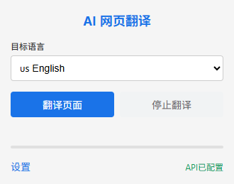
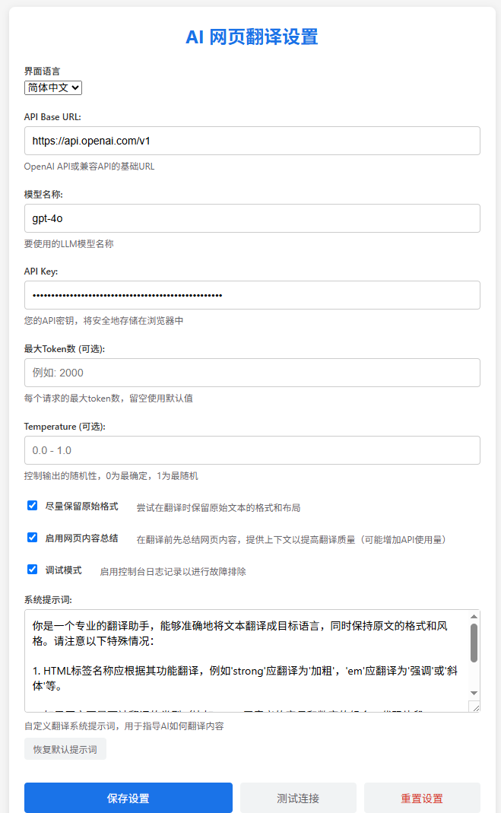
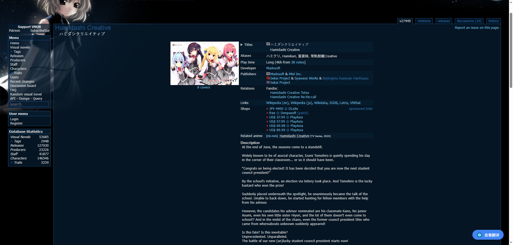
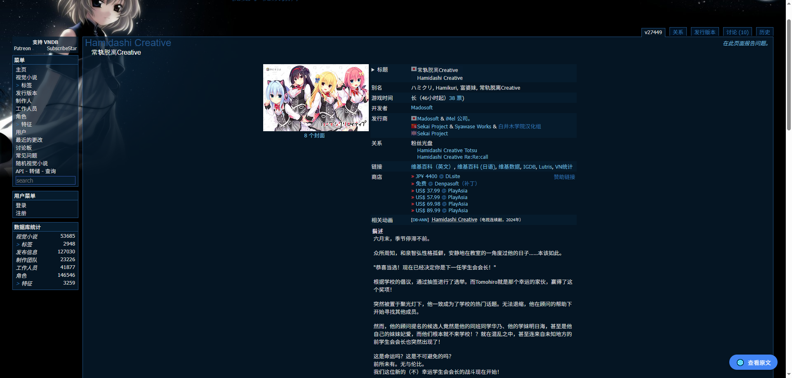
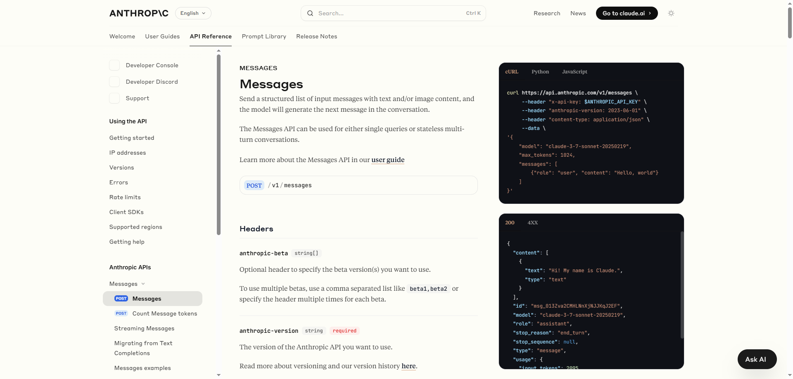
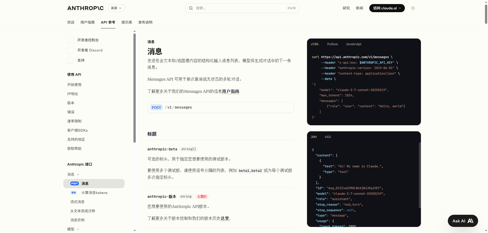

# AI 网页翻译 Chrome 插件

[English](README.md) | 简体中文

## 项目介绍

AI 网页翻译是一款基于大型语言模型(LLM)的 Chrome 浏览器插件，旨在提供比传统机器翻译更加准确、自然的网页翻译体验。它可以替代 Chrome 浏览器自带的翻译功能，通过 AI 技术理解网页的整体上下文，提供更加精准的翻译结果。

## 核心特点

### 🤖 基于 LLM 的高质量翻译

- 利用大型语言模型进行翻译，相比传统机器翻译提供更自然、更准确的翻译结果
- 支持网页内容总结功能，通过理解整个网页的上下文来提高翻译质量
- 保持原始网页的格式和布局，提供无缝的阅读体验

### ⚙️ 高度可定制化

- **自定义 API 配置**：支持 OpenAI API 及兼容接口，可自定义 API Base URL
- **自定义模型选择**：可选择不同的 LLM 模型（如 deepseek-reasoner、gpt-4o、claude-3-7-sonnet 等）
- **自定义翻译参数**：可调整温度、最大 token 数等参数
- **自定义系统提示词**：可自定义翻译系统提示词，精确控制翻译风格和质量

### 🌐 多语言支持

- 支持多种语言之间的互译（简体中文、英语、日语、韩语、法语、德语、西班牙语、俄语等）
- 插件界面支持中英双语切换

### 🔄 便捷的操作体验

- 一键翻译当前网页
- 在原文和翻译之间快速切换
- 翻译过程中可随时中止
- 实时显示翻译进度

## 功能展示

### 插件弹出窗口

### 设置页面

### 翻译效果展示
> ### [VNDB详情页面](https://vndb.org/v27449)
> 
> 

> ### [Claude Messages API文档](https://docs.anthropic.com/en/api/messages)
> 
> 

## 安装说明

1. 下载或克隆本仓库到本地
2. 打开 Chrome 浏览器，进入扩展程序页面（chrome://extensions/）
3. 开启"开发者模式"
4. 点击"加载已解压的扩展程序"，选择本仓库文件夹
5. 插件将被安装到 Chrome 浏览器中

## 使用方法

1. 点击 Chrome 工具栏中的插件图标打开弹出窗口
2. 在设置页面配置 API 信息（点击"设置"按钮）：
   - API Base URL（例如：https://api.openai.com/v1）
   - 模型名称（例如：gpt-4o）
   - API Key
   - 可选参数（最大 Token 数、Temperature 等）
3. 选择目标语言
4. 点击"翻译当前页面"按钮开始翻译
5. 翻译过程中可以点击"停止翻译"按钮随时中止
6. 翻译完成后，可以使用页面右下角的切换按钮在原文和翻译之间切换

## 隐私说明

- 插件仅在用户主动点击"翻译当前页面"按钮时才会处理网页内容
- API 密钥和其他设置仅存储在本地浏览器中，不会发送到任何第三方服务器
- 翻译过程中，网页内容会发送到用户配置的 API 服务器进行处理
